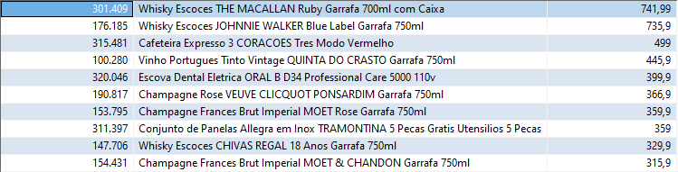
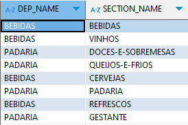
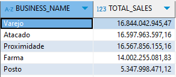

# Consultas SQL

## What are the 10 most expensive products in the company?
para responder essa pergunta utilizei a seguinte query: 

```sql
SELECT 
    PRODUCT_COD,
    PRODUCT_NAME,
    PRODUCT_VAL
FROM 
data_product
ORDER BY 
    PRODUCT_VAL DESC
LIMIT 10;
```
### Resultado da consulta


## What sections do the 'BEBIDAS' and 'PADARIA' departments have?

para responder essa pergunta utilizei a seguinte query: 

```sql
SELECT 
    DEP_NAME,
    SECTION_NAME
FROM 
data_product dp 
WHERE 
    DEP_NAME IN ('BEBIDAS', 'PADARIA')
GROUP BY 
    DEP_NAME, SECTION_NAME;
```
Ou seja, dentro do departamento de **BEBIDAS**, temos: `bebidas`, vinhos, cervejas e refrescos. Já em **PADARIA**,  doces-e-sobremesas, queijos-e-frios, `padaria` e `gestante`.

**OBS:** Vale ressaltar as sessões em destaque, sessão de gestante no departamento padaria, não parece fazer sentido. E a sessão com o mesmo nome do departamento, vale entender a regra do negócio.

### Resultado da consulta



## What was the total sale of products (in $) of each Business Area in the first quarter of 2019?

Nesta query foi levado em consideração que para encontrar o valor total de vendas, multiplicamos o valor pela quantidade. Mas se o campo valor, já está refletido isso. A query mudaria apenas o `SUM` no `SELECT` para `SUM(ps.SALES_VALUE)`

```sql
SELECT 
    sc.BUSINESS_NAME,
    SUM(ps.SALES_QTY * ps.SALES_VALUE) AS TOTAL_SALES
FROM 
    data_product_sales ps
JOIN 
    data_store_cad sc ON ps.STORE_CODE = sc.STORE_CODE
WHERE 
    ps.DATE >= '2019-01-01' AND ps.DATE < '2019-04-01'  
GROUP BY 
    sc.BUSINESS_NAME
ORDER BY 
    TOTAL_SALES DESC;  
```

### Resultado da consulta



## Arquitetura do Projeto

O projeto foi organizado em quatro arquivos principais, utilizando conceitos de Programação Orientada a Objetos para maior modularidade:

**Classe `Database`:**
   - Responsável por gerenciar a conexão com o banco de dados MySQL.
   - A função `retrieve_data` permite que a consulta seja feita de maneira flexível, com base em parâmetros fornecidos (ex.: `product_code`, `store_code` e intervalo de `date`).

**Abstração com POO:**
   - A Programação Orientada a Objetos foi utilizada para encapsular a lógica da conexão e consulta dentro da classe `Database`. Isso facilita a reutilização e modularização do código em diferentes partes do projeto.
   - A função criada foi testada e implementada no `case_1`.


- `database.py`: Classe responsável pela conexão com o banco de dados MySQL e pela execução de consultas SQL.

```python
import mysql.connector
import pandas as pd
from mysql.connector import Error

class Database:
    def __init__(self, host, port, user, password, database):
        self.host = host
        self.port = port
        self.user = user
        self.password = password
        self.database = database
        self.cnx = None

    def connect(self):
        """Estabelece a conexão com o banco de dados."""
        try:
            self.cnx = mysql.connector.connect(
                host=self.host,
                port=self.port,
                user=self.user,
                password=self.password,
                database=self.database
            )
            print("Connection ok.")
        except Error as e:
            print(f"Error: {e}")

    def close(self):
        """Fecha a conexão com o banco de dados."""
        if self.cnx.is_connected():
            self.cnx.close()
            print("Connection closed.")

    def retrieve_data(self, product_code=None, store_code=None, date=None):
        """Recupera dados da tabela data_product_sales com base nos parâmetros fornecidos."""
        try:
            if self.cnx is None or not self.cnx.is_connected():
                self.connect()
                
            query = "SELECT * FROM data_product_sales WHERE 1=1"  # Começar a consulta com um true
            params = []

            if product_code is not None:
                query += " AND product_code = %s"
                params.append(product_code)

            if store_code is not None:
                query += " AND store_code = %s"
                params.append(store_code)

            if date is not None and len(date) == 2:
                query += " AND date BETWEEN %s AND %s"
                params.extend(date)

            # Executa a consulta
            with self.cnx.cursor() as cur:
                cur.execute(query, params)
                results = cur.fetchall()
            
            # Cria um DataFrame com os resultados
            df = pd.DataFrame(results, columns=[i[0] for i in cur.description])
            return df

        except Error as e:
            print(f"Error: {e}")
            return pd.DataFrame()  # Retorna um DataFrame vazio em caso de erro
    def execute_query(self, query):
        """Executa uma consulta SQL e retorna um DataFrame."""
        if self.cnx is None or not self.cnx.is_connected():
            self.connect()
        try:
            df = pd.read_sql(query, self.cnx)
            return df
        except Error as e:
            print(f"Error executing query: {e}")
            return pd.DataFrame()  # Retorna um DataFrame vazio em caso de erro
```

## Case 1: Verifica a função de recuperação de dados da tabela `data_product_sales`.

Utiliza a classe Database para conexão e faz uso da função `retrieve_data` para realizar consultar com filtros no banco.

```python

import os
from dotenv import load_dotenv
from database import Database

load_dotenv()

def test_retrieve_data():
    db = Database(
        host=os.getenv('DB_HOST'),
        port=int(os.getenv('DB_PORT')),
        user=os.getenv('DB_USER'),
        password=os.getenv('DB_PASSWORD'),
        database=os.getenv('DB_NAME')
    )

    # Teste
    my_data = db.retrieve_data(product_code=18, store_code=1, date=['2019-01-01', '2019-01-31'])
    print("Valid parameters")
    print(my_data)

    db.close()

if __name__ == "__main__":
    test_retrieve_data()

```

## Case 2: Processamento de Consultas e Cálculo do Ticket Médio (TM)

Este caso mostra como processar dados de vendas e calcular o Ticket Médio (TM) usando a classe `Database` e o pandas para manipulação dos dados. O código foi estruturado da seguinte maneira:

```python

import pandas as pd
from database import Database
import os
from dotenv import load_dotenv


load_dotenv()


class QueryProcessor:
    def __init__(self, db: Database):
        self.db = db

    def fetch_stores(self):
        query = """
        SELECT
            STORE_CODE,
            STORE_NAME,
            BUSINESS_NAME,
            BUSINESS_CODE
        FROM data_store_cad
        """
        return self.db.execute_query(query)

    def fetch_sales(self, start_date, end_date):
        query = f"""
        SELECT
            STORE_CODE,
            DATE,
            SALES_VALUE,
            SALES_QTY
        FROM data_store_sales
        WHERE DATE BETWEEN '{start_date}' AND '{end_date}'
        """
        return self.db.execute_query(query)

    def process_queries(self, start_date, end_date):
        stores_df = self.fetch_stores()
        sales_df = self.fetch_sales(start_date, end_date)

        merged_df = pd.merge(stores_df, sales_df, on='STORE_CODE', how='left')

        average_sales_df = merged_df.groupby(['STORE_NAME', 'BUSINESS_NAME']).agg(
            Average_Sales_Value=('SALES_VALUE', 'sum'),
            Total_Sales_Qty=('SALES_QTY', 'sum')
        ).reset_index()

        # Calcula a média e arredonda
        average_sales_df['TM'] = average_sales_df.apply(
            lambda row: round(row['Average_Sales_Value'] / row['Total_Sales_Qty'], 2) if row['Total_Sales_Qty'] > 0 else 0, 
            axis=1
        )

        # Renomeia as colunas conforme o necessário
        average_sales_df = average_sales_df[['STORE_NAME', 'BUSINESS_NAME', 'TM']]
        average_sales_df.columns = ['Loja', 'Categoria', 'TM']

        return average_sales_df

if __name__ == "__main__":
    # Crie uma instância da classe Database com as credenciais
    db = Database(
        host=os.getenv('DB_HOST'),
        port=int(os.getenv('DB_PORT')),
        user=os.getenv('DB_USER'),
        password=os.getenv('DB_PASSWORD'),
        database=os.getenv('DB_NAME')
    )
    
    # Crie um processador de consultas e processa as consultas
    processor = QueryProcessor(db)
    result_df = processor.process_queries('2019-10-01', '2019-12-31')
    
    # Exibe o resultado no formato desejado
    print(result_df.to_string(index=False))

    # Fecha a conexão
    db.close()

```

## Case 3: Visualização de Filmes por Gênero e Ano

Este exemplo mostra como criar uma visualização de filmes, categorizados por gênero, ao longo dos anos. Utiliza a biblioteca matplotlib para gerar gráficos de barras empilhadas.

Utilizei a biblioteca matplotlib, geralmente utilizo ela para fazer análises e plot de gráficos, junto ao pandas, dito isso, foi uma escolha natural.

```python

import matplotlib.pyplot as plt
import pandas as pd
from database import Database
import os
from dotenv import load_dotenv

load_dotenv()

class MovieVisualizer:
    def __init__(self, db):
        self.db = db

    def fetch_movies_data(self):
        query = "SELECT Genre, Votes, Year FROM IMDB_movies"
        movies_df = self.db.execute_query(query)
        return movies_df

    def plot_genre_distribution_by_year(self):
        movies_df = self.fetch_movies_data()

        # Quebrar os gêneros em linhas separadas
        movies_df['Genre'] = movies_df['Genre'].str.split(',')
        movies_exploded = movies_df.explode('Genre')

        # Contar a quantidade de filmes por gênero e ano
        genre_year_counts = movies_exploded.groupby(['Year', 'Genre']).size().unstack(fill_value=0)

        # Criar um gráfico de barras empilhadas
        genre_year_counts.plot(kind='bar', stacked=True, figsize=(12, 6), colormap='tab20')

        # Adicionar títulos e rótulos
        plt.title('Distribuição de Filmes por Gênero ao Longo dos Anos', fontsize=16)
        plt.xlabel('Ano', fontsize=14)
        plt.ylabel('Número de Filmes', fontsize=14)
        plt.xticks(rotation=45)

        plt.tight_layout()  # Ajusta o layout para evitar sobreposição
        plt.show()

if __name__ == "__main__":
    # Conexão ao banco de dados e execução do visualizador
    db = Database(
        host=os.getenv('DB_HOST'),
        port=int(os.getenv('DB_PORT')),
        user=os.getenv('DB_USER'),
        password=os.getenv('DB_PASSWORD'),
        database=os.getenv('DB_NAME')
    )

    visualizer = MovieVisualizer(db)
    visualizer.plot_genre_distribution_by_year()

    db.close()

```

<div align="center">
<h2>Herbert Souto</h2>
<a href="https://github.com/herbertsouto">GitHub</a>
</div>
